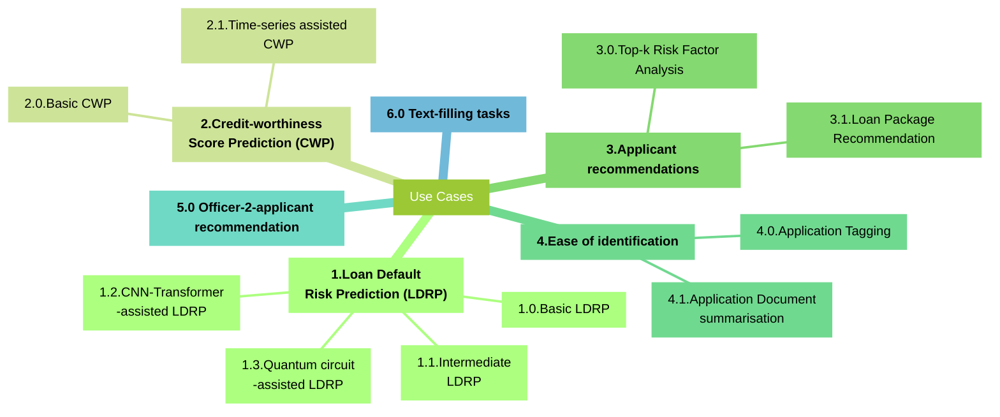

# Krungsri Katalyst Dashboard implementation plan (DBTT G1 group 3)
Project notebooks and implementations for backend to process and return data

This backend service provides an API to serve a PyTorch model for inference.

## Prerequisites (for running backend)

- Python 3.8+
- pip (Python package installer)

## Setup Instructions

1. Install the required Python packages:

```bash
make setup
```

2. Place the PyTorch model file (`.pt` file) in the `models/` directory.

3. Start the backend service:

```bash
make run
```
This ensures that the proper version of packages will be used.

# Use Cases and Implementations

We have designed the following use-cases, with each feature following the naming convention: `<mvp_num>.<usp_num>`, representing the main use-cases that we will term as the "Minimum Viable Product" (MVP) and extensions to these use-cases that we will term as "unique selling points" (USPs), ie. Feature `1.0` will refer to our first MVP, while `4.2` refers to the 2th USP under our 4th MVP.  

In our scenario, we deal with 2 parties:
1. Loan Officers: employees who are responsible for assessing loan applicants, ensuring they have the proper documentation and appropriate risk that will prevent their documentation from falling apart.
2. Risk Manager


### Diagram Representation of use cases:


| Feature | s/n | Description | Implementation |
|---------|---------|-------------|--------|
| Basic Loan Default Risk Prediction (LDRP)| 1.0| <div style="text-align: justify"> Currently handled manually by officers mid live consultation with clients. Relevant details are computed on the spot mid-consult. At best, officers might have implemented Robotic Process Automation (RPA) themselves using excel formulas and VBA, albeit the formulas used may not be standardised. At worst, Officers will rely more on provided documentation and manually verify the statistics for each application. This can be automated and standardised for officers.</div> | Inspired by baseline notebook written by [Kaggle user Akhil Shukla](https://www.kaggle.com/code/akhil14shukla/loan-defaulter-prediction), we will use a logistic regression model made with SKlearn's library, with customizations obtain the associated probability using a pre-made method, to make predictions whether a client will default on their loan. Additionally, we will bolster the reliability of the model by introducing two regularization and optimization technniques: Randomsearch Cross-Validation for Parameter search on the continuous parameter `intercept`, and k-fold cross-validation (using a value of k=10). | 
| Intermedate LDRP| 1.1|<div style="text-align: justify"> Extending from Feature 1.0, we now use alternative models, should the existing model for basic credit prediction be insufficient given the dataset. </div> | We can swap out the Baseline model, and implement the following alternative models: <ol><li>A Random Forest (RF) model</li><li>A gradient boosted decision tree model, from the XGBoost Library </li><li>The K nearest neighbours classifier, where we will implement RandommsearchCV for an optimal number of clusters, K</li><li>A support vector machine classifier</li><li>A Mixture of Experts (MoE) model </li><li>Kolmogorov-Arnold Networks (KANs), with a specific schema for credit default prediction named [KACDP]((https://arxiv.org/abs/2411.17783)) for high interpretability, obtained from a paper</li></ol>|
| Transformer-assisted LDRP <br>(For capacity building) | 1.2 | Extending from Feature 1.0, we can incorporate CNN transformer architecture into our loan prediction model. | Due to a lack of data, we will be providing a possible implementation indicated in [this paper](https://arxiv.org/abs/2412.18222), and outlining a possible timeline for developing a pipeline and implementing this solution.|
| Quantum-Circuit assisted LDRP <br> (For capacity building) | 1.3 | Extending from Feature 1.0, , we can incorporate quantum-circuit-based neural networks for loan default predictions given how well quantum systems are at simulating economic circumstances. | Due to a lack of data, we will be providing a possible implementation indicated in the papers linked, and outlining a possible timeline for developing a pipeline and implementing this solution. ([Paper 1](https://arxiv.org/abs/2502.07806),[Paper 2](https://arxiv.org/abs/2412.18222))|
|Basic Credit-Worthiness Score Prediction (CWP) | 2.0 | We can standardise and automate the estimation for how well loan applicants are at managing their credit based on their credit history. <br>For clarity, please note that this score is different from LDRP in feature 1, as we assume that this score handles factors that are more heavily-influenced by economic factors relative to LDRP.  | The same models in features 1.0, 1.1 and 1.2 can be used.|
| CWP with Time-series economic data <br>(For capacity building)| 2.1 | We can incorporate the use of autoregressive models to take in time-series data reflecting various economic indicators about Thailand to objectively adjust a client's predicted loan defaulting probability. | We will establish a data pipeline for obtaining time-series data for specific economic factors, label them with the average risk for that time period, and train an autoregressive model to output as many weights as there are factors at  monthly intervals . These weights will then be used by a single KANs neural network layer, and modify the final output probability of loan defaulting. This effectively factors in the economic conditions when determining the probability of loan default and standardises any economic considerations that should be made.|
|Top-k Risk Factor Analysis | 3.0 | We can standardise and automate the estimation of the top k factors for loan defaulting based on the loan applicant. For simplicity, we will set k = 3 (and effectively rank the top 3 factors) | As a starting point, we will be using the SHapley Additive exPlanations (SHAP) and assessing which factors are the most responsible for a value's improvement given a specific applicant.We will be using recommender systems, specifically a factorizing machine, or the KACDP model.|
| Loan Package Recommendation <br>(For capacity building) | 3.1 | With the current information, we can provide officers with a recommended loan package with suggested amounts, tenures and Loan Term.| We will be using recommender systems, specifically a factorizing machine for pre-decided package amounts.|
| Application-tagging for identification | 4.0 | Given the massive volume of details that Loan officers have to handle, distinguishing between loan applications may be difficult. Thus, we propose to use a large pool of pre-set text tags, and use machine learning to tag the top 3 categories that each application represents for ease of identification by officers. | We will perform Topic Modelling using an encoder-only transformer model like BERTopic to select from a pool of pre-set tags that best represent the loan application. However for this implementation, we will not be using a fine-tuned model, since a refined one needs to be trained on good data, which requires a data pipeline built on a large volume of loan application documents.|
| Application document summarisation for identification | 4.1 | To supplement the issue raised in feature 3.0, we can also add a 15 word summary of the documentation provided to help officers semantically distinguish applications. This summary will be viewable as an icon tooltip from the overall view of all the applications.| We will use a multi-document machine summarization model, BART for this. However, we will only use this model for inference, and not be training it becauseof the lack of real and proper data we possess. For more details of how training and implementation are done, you may refer to [this medium article by AShwin N](https://medium.com/@ashwinnaidu1991/multi-document-summarization-with-bart-c06db25df62a). However, we will be demonstrating how pdf document parsing could work with the help of the python library [llmware](https://github.com/llmware-ai/llmware). Additionally, given that the documents are less text-heavy, we can look towards the use of LLMs in Financial Statement Analysis in a recent study, and approximate that it is able to provide similar, if not better, results based on a recommended decision and some reasoning for it as per the prompt. This prompt can also be optimized using prompt engineering building from a database of documents and hand-labelled insights from officers, and optimized using the ROUGE score.  |
| Officer-2-Applicant recommendation | 5.0 | The Relations Manager has to assign loan applicants to officers as they come in, ensuring that applicants are not only processed efficiently, but also result in successful, non-defaulted applications. Thus, we can use machine learning to recommend officers based on factors like case history, scorecard statistics, their proficiency handling specific case types, and their average number of applicant interactions. | We can implement one of many models in this scenario: <ol><li>A Gaussian Mixture Model, with the number of components being the number of officers we have (albeit the model constantly needs to be updated using the EM algorithm)</li><li>A recommender system that uses a factorizing machine model for content-based filtering, factoring in both the loan applicant's existing traits, alongside some scorecard statistics for each officer.</li>|
| Text-filling Tasks <br>(for capacity building)| 6.0 | Loan Officers will need to communicate with applicants over various matters while handling their application, for the following tasks: <ol><li>Scheduling physical meetings</li><li>remediation for application discrepancies (ie proof of employment doesn't match the entered job)</li><li>Remediation of risk factors to improve loan scores </li></ol> Currently, this process is handled manually, where officers will pick from a few predetermined text snippets that match their task, then edit them according to the task at hand. We can automate this text-filling process. Officers will thus be more productive, needing only to read through what was generated, and be able to better spot mistakes in the generation process. |We will be using a locally hosted LLM that will: <ul><li>take in both a text prompt and a summary of the issues set by the officer, and produce an enterprise-ready response that the officer can vet before sending to the applicant</li> <li>take in just the summary of issues, use RAG to pick out the most appropriate text snippet, then generate a response for the loan officer to vet before sending to the applicant.</li></ul>|

# References for data sources

| Name | Use | link |
|---------|---------|-------------|
|Home Equity dataset (HMEQ) | For Credit risk prediction <br> (see all uses under Feature 1) |[Kaggle](https://www.kaggle.com/datasets/ajay1735/hmeq-data) |
|Give Me Some Credit (GMEC) | Competition Dataset for robust credit information predictions |[Kaggle](https://www.kaggle.com/c/GiveMeSomeCredit/data) |

- Referenced Notebooks, source code and articles are available in the usecases outlined as links.

# Assumptions (and remedial action where applicable)
- The variables considered within the HMEQ dataset are the most critical for determining Credit risk.
- The economic conditions that the dataset was obtained from approximately mimics the conditions that the data has been collected from (namely being the United States of America.)
    - MLOPs will need to develop a data pipeline to automatically update the models used, referencing Kungsri's data-warehouses.


